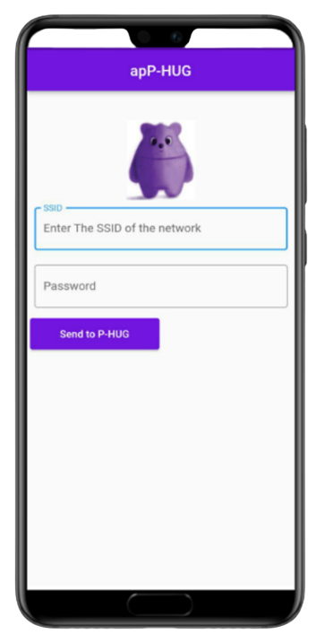

# apP-HUG

apP-HUG is an application to provide network data to Giffy using NFC in an easy way

## Installation

Download the application from this link:

[apP-HUG](https://github.com/AlessandroBarbiero/Robotics-and-Design-project/blob/main/App/APK/apP-HUG.apk)

During installation you may encounter warnings informing you that the application may not be safe. This is because the application is not uploaded to the Google Play Store. 

Accept all the conditions, install it and you now should see a screen like this:

## How to use the app 

Before turning on the robot:

- Open the application,Activate your hotspot/wifi and NFC in your mobile phone 

- Add SSID of the network in the first text field and the password in the second textfield (username and password have to be maximum 15 characters lenght each)

- Press the send message

- Put your cell phone close to the Giffy's head and wait untill the NFC is red (you should notice a vibration)

Now you are ready! Enjoy GIFFY !!!