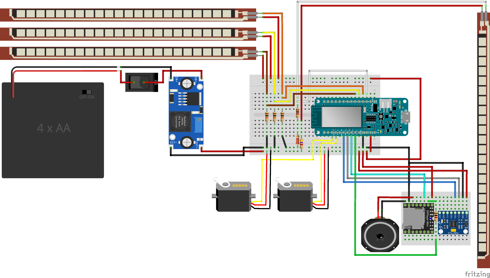
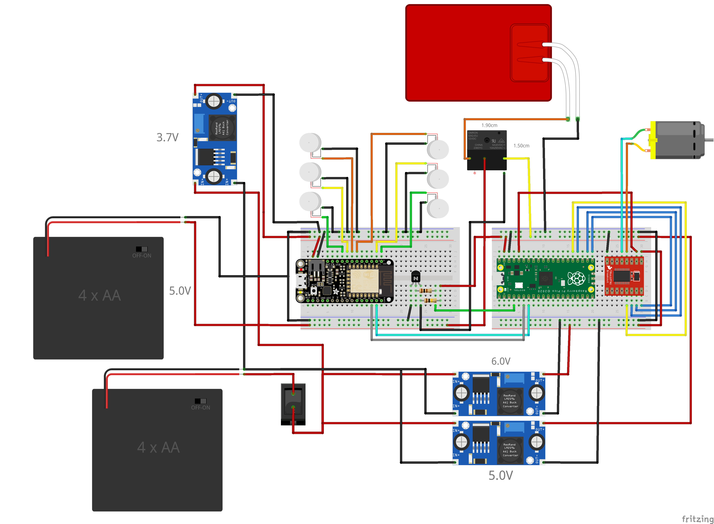

# Robotics and Design project
Make a wearable robot able to engage interactions with third people.

## Abstract
According to surveys and research the haptic sense is a significant aspect of human wellbeing. The experience received as a result of contact with another living creature like hugs stimulates serotonin production. High serotonin levels improve mood, make people feel better, and help having better sleep. Nowadays people are more linked than ever before as a result of the developing trend of technology. While technology has helped to bridge the gap, it has not been able to eliminate all the barriers imposed by distance. Our initiative primarily aims to bridge this gap by creating a product that sends a haptic hug from one device (Giffy: the puppet) to another one (the Jacket). The embrace and caress from the puppet is transfered via a wifi connection to the wearer of the jacket. The wearer can feel three major sensations: vibration achieved by vibration motors simulating a moving caress, pressure from an inflatable chamber simulating a hug, and a constant warm feeling from a resistive wire. Our goal is not to replace an actual embrace, but to help people that live apart and cannot hold their loved ones having a fraction of that so desired contact.

## Electronics organization
Here are reported the wiring schemas for the two devices
### `__Giffy__`
Built around an `Arduino Mkr1000 wifi`

Input:
- 3 Force sensitive resistors to simulate the caress
- Force sensitive resistor to simulate the hug
- Accelerometer to detect shaking

Output:
- 2 Servo motors to move the ears
- Speaker
- Integrated Wifi module (ATSAMW25) of Arduino Mkr1000 wifi



##

### `__The Jacket__`
Built around an `Adafruit Feather Huzzah`

Input:
- Integrated Wifi module (ESP8266) of Adafruit Feather Huzzah 

Output:
- 6 Vibration motors to simulate the caress
- Air pump to inflate the chamber around the waist to simulate the hug
- Heating resistance activated via a relè



## Code organization
All the code has been written following the object oriented programming model with the help of the platform `PlatformIO`.
The main idea is to build a client-server model to receive the information from Giffy and send it to the jacket that operates according to that.

The code can be seen in the folders [Client](/Client/) for Giffy and [Server](/Server/) for the Jacket.

## How to run the project
1. Clone the repository
    ```bash
    git clone {repository URL}
    ```
2. Download an IDE (suggested [PlatformIO](https://platformio.org/) for `Visual Studio Code`).
3. Open the folder [Client](/Client/) or [Server](/Server/Server%20Huzzah/) as `PlatformIO project` from the PlatformIO home.
4. Click on `PlatformIO:upload` on the bottom left.

## Team
### Engineers

* [__Alessandro Barbiero__](https://github.com/AlessandroBarbiero)
* [__Luigi Altamura__](https://github.com/LuigiAltamura)
* [__Lorenzo Poretti__](https://github.com/lap98)
* [__Elias Insulander__](https://github.com/eliasinsulander)

### Designers

* __Lorenzo Dondi__
* __Helen Berhanu Tekle__